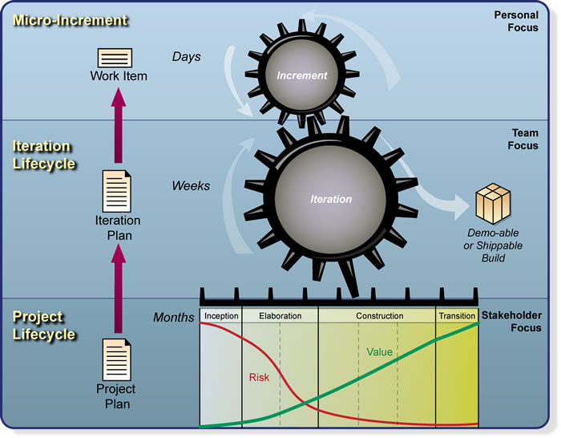
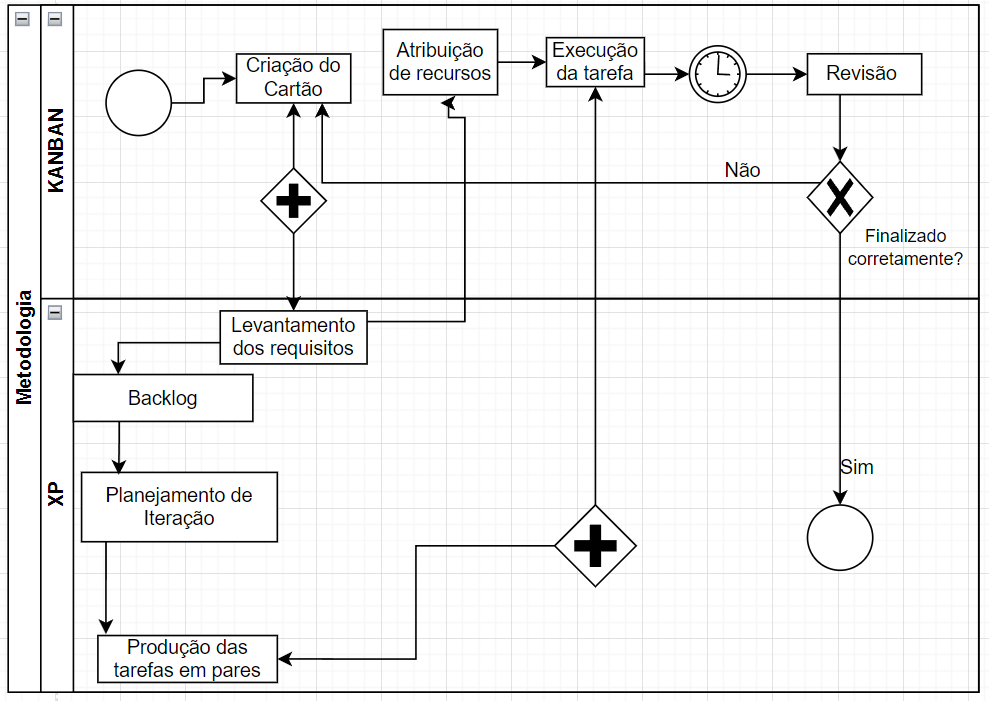

# Módulo Processos/Metodologias/Abordagens

## 1.2.1 Introdução 

Este artefato é destino à construção e modelagem dos processos e metodologias que serão utilizadas durante o desenvolvimento deste projeto.

## 1.2.2 Justificativas das Escolhas Metodológicas 

### 1.2.2.1 OpenUP

Baseado no RUP (Rational Unified Process), o OpenUp é um processo de desenvolvimento que procurou otimizar e agilizar o RUP. No caso do OpenUp, ele mantém vários dos princípios do RUP, mas se familiarizou com as práticas ágeis bem como com os princípios do Lean. Conforme pode ser visualizado melhor através da imagem a seguir: 

<small style="color: purple; font-weight: bold;">Figura 1: OpenUP layers - micro-increments, iteration lifecycle and project lifecycle.</small>

Porém, o grupo optou por essa realizar uma adaptação desta metodologia, ou seja, iremos nos basear nos princípios e fases de tal metodologia, tais como: 

- Princípios de Microincrementos (Micro-increment): 
    - Os microincrementos representam pequenas unidades de trabalho que produzem um passo do progresso constante e mensurável. Estes microincrementos fornecem um ciclo de feedback extremamente curto, que direciona decisões adaptativas durante cada iteração (OpenUP, 2010);
    
    - Considerando que o escopo do projeto é pequeno, iremos realizar a separação das atividades por semanas;

    - Cada fase pode ter quantas iterações forem necessárias. Os marcos ajudam a equipe do projeto a acompanhar o progresso, identificar pontos de verificação importantes e manter o projeto alinhado com os objetivos gerais; 

- Metodologia Customizável: 
    - Essa metodologia possibilidade uma grande flexibilidade, o que proporciona possíveis mudanças no desenvolver do semestre caso seja necessário; 

    - Adaptações de acordo com as reais necessidades da equipe; 

- Orientada para equipes pequenas e co-localizadas; 

- Definição de papéis: 

 
<b>Tabela 1:</b> Definição da Divisão dos Papéis no OpenUP

| Papel              | Descrição                                                                                                                                                                                                                                                                                  |
| ------------------ | ------------------------------------------------------------------------------------------------------------------------------------------------------------------------------------------------------------------------------------------------------------------------------------------ |
| Arquiteto          | Responsável por definir a arquitetura de software, incluindo a tomada das principais decisões técnicas que orientam todo o desenho e a implementação do projeto.                                                                                                                           |
| Gerente de Projeto | Conduz o planejamento do projeto, coordena as interações com os stakeholders e mantém a equipe de projeto focada em alcançar os objetivos do projeto.                                                                                                                                      |
| Analista           | Representa os interesses do cliente e do usuário final recolhendo informações dos stakeholders para entender o problema a ser resolvido, capturando os requisitos e definindo suas prioridades.                                                                                            |
| Testador           | Responsável pelas principais atividades do esforço de teste. Estas atividades incluem identificar, definir, implementar e conduzir os testes necessários, bem como registrar e analisar os resultados dos testes.                                                                          |
| Qualquer papel     | Qualquer um em uma equipe pode atuar neste papel executando diversas tarefas.                                                                                                                                                                                                              |
| Desenvolvedor      | Responsável por desenvolver uma parte do sistema, incluindo a construção de seu desenho de forma que ele atenda a arquitetura e possivelmente a prototipagem da interface de usuário, e então implementar, executar o teste de unidade e integrar os componentes que são parte da solução. |
| Stakeholder        | Representa grupos de interessados cujas necessidades devem ser satisfeitas pelo projeto. É um papel que pode ser executado por qualquer um que seja (ou potencialmente possa ser) afetado pelo resultado do projeto.                                                                       |

<small style="color: purple; font-weight: bold;">Documentação do OpenUP, 2010 <a id="anchor_1" href="#REF1">[1]</a></small>

### 1.2.2.2 XP 

Essa metodologia será utilizada não apenas nas entregas que resultam em uma implementação de códigos, mas também em todos os artefatos que serão desenvolvidos. Da Metodologia XP, serão utilizados os seguintes ritos:

- Interaction Planning: 
    - Reunião de planejamento da iteração, a qual será realizada no início de cada iteração e irá produzir um plano das atividades que deverão ser realizadas; 

- Pair Programming (Pareamento): 
    - Todos os artefatos desenvolvidos deverão ser criados por um par, que trabalharão em conjunto durante o desenvolvimento devido a quantidade de membros do grupo; 

- Definição de expectativas entre os membros da equipe
    - Não são o objetivo final em si, mas definem um ambiente que promove a colaboração e o empoderamento da equipe. Uma vez alcançado, o trabalho em equipe produtivo continuará mesmo que as regras sejam alteradas para atender às necessidades do projeto; 

### 1.2.2.2 Kanbam 

Um dos métodos de gerenciamento de fluxos de trabalhos utilizados será o Kanbam, de forma que a gestão será orientada ao Kanban visando otimizar o fluxo de trabalho através da utilização de quadros visuais. Embora a metodologia completa contenha um conjunto abrangente de diretrizes e práticas, o grupo concluiu que o quadro de visibilidade é a ferramenta mais relevante para o desenvolvimento do projeto.

A ferramenta utilizada para construção do quadro será o Github no próprio repositório do grupo conforme pode ser visto na imagem abaixo. 

<small style="color: purple; font-weight: bold;">Figura 2: Quadro Kanbam do projeto.</small>

## 1.2.3 Modelagem BPMN 

O BPMN (Business Process Model and Notation) é uma notação gráfica para modelagem de processos de negócio, permitindo que processos complexos possam ser representados de forma clara e padronizada. É uma ferramenta utilizada para documentar, analisar, comunicar e gerenciar processos de negócio de uma organização, permitindo que todos os envolvidos tenham uma compreensão clara e unificada do processo. A notação é composta por um conjunto de símbolos gráficos, que representam atividades, eventos, gateways, fluxos, objetos de dados, entre outros elementos, que juntos compõem o processo de negócio. A utilização do BPMN proporciona uma série de benefícios para as organizações, incluindo a melhoria da eficiência operacional, a redução de custos, o aumento da agilidade empresarial e a capacidade de responder rapidamente a mudanças no ambiente de negócios.

Adotamos uma abordagem metodológica que combinava os princípios do Kanban e do Extreme Programming (XP). Utilizamos o Kanban como estrutura para acompanhar o progresso. Ao mesmo tempo, incorporamos os princípios do XP para garantir uma abordagem ágil e colaborativa no desenvolvimento das soluções propostas. Essa combinação de metodologias nos permite gerenciar efetivamente o trabalho, manter a flexibilidade necessária para lidar com mudanças e focar na entrega de resultados de alta qualidade de forma iterativa e incremental.

<small style="color: purple; font-weight: bold;">Figura 3: BPMN Kanban/Xp. (Fonte: Augusto Duarte,2024)</small>

## 1.2.4 Conclusão 

## 1.2.5 Referências Bibliográficas 

> <a id="REF1" href="https://www.utm.mx/~caff/doc/OpenUPWeb/">Documentação do OpenUP</a>

> <a id="REF2" href="https://kanban.university/kanban-guide/">Kanban Guide</a>

> <a id="REF3" href="http://www.extremeprogramming.org/">Extreme Programming</a>

> <a id="REF4" href="https://www.omg.org/bpmn/">BPMN Guide</a>

## 1.2.6 Controle de Versionamento 

| Versão | Data da alteração |            Alteração             |                   Responsável                    |                   Revisor                    | Data de revisão |
| :----: | :---------------: | :------------------------------: | :----------------------------------------------: | :------------------------------------------: | :-------------: |
|  1.0   |    07/04/2024     |       Criação do Artefato        | [Suzane Duarte](https://github.com/suzaneduarte) | [Augusto Duarte](https://github.com/Augcamp) |   07/04/2024    |
|  1.1   |    07/04/2024     | Desenvolvimento do tópico #1.2.2 | [Suzane Duarte](https://github.com/suzaneduarte) | [Augusto Duarte](https://github.com/Augcamp) |   07/04/2024    |
|  1.2   |    07/04/2024     | Desenvolvimento do tópico #1.2.3 |   [Augusto Duarte](https://github.com/Augcamp)   |                   Inserir                    |     Inserir     |

